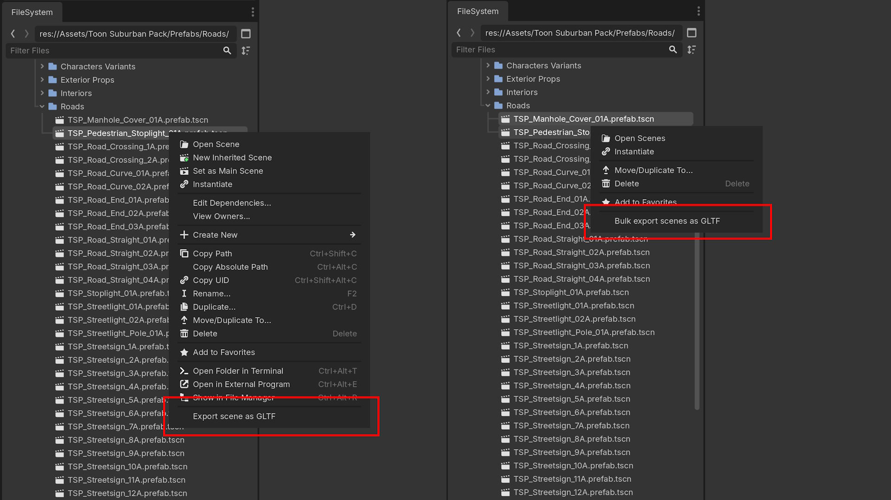

# Bulk Export Scenes

This addon adds a context menu to the FileSystem allowing glTF export of one or more scenes. Files can be saved in either `.gltf` or `.glb` formats.

## Usage

* `git clone` to *addons/bulk_export_scenes* folder
* Activate in *Project - Project Settings - Plugins*
* Right click on one `.tscn` file and click *Export scene as GLTF*
* Right click on multiple `.tscn` files and click *Bulk export scenes as GLTF*

A dialogue window will appear asking for a destination. For single export just change the file extension. Bulk export dialogue has an option at the bottom to select file format.